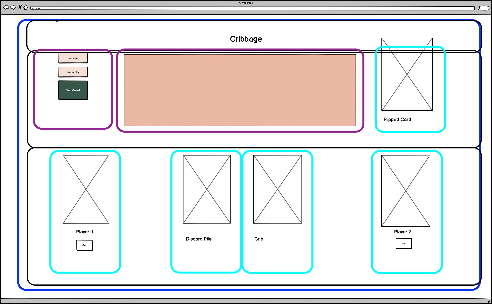
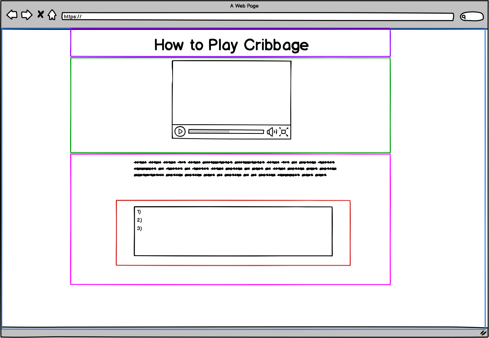

# Cribbage2.0
## Classic Cribbage game brought to life online!
================================================

## Project Link

[Cribbage 2.0](https://plinytheyounger.github.io/Cribbage2.0/)

================================================

## Game Summary

Cribbage is a classic (usually 2-player, but possibly more) card game that involves a 52 card deck, and usually a cribbage board and small pegs for the board.

This game was and is a staple in my house growing up, it is fairly simple in theory, but involves many subtleties, strategy and gambling to score the maximum amount of points each round. 

This version involves a human player against a computer and includes some modifications to the rules. 

For a bit of [history](https://en.wikipedia.org/wiki/Cribbage).

## Technology
* HTML5
* CSS
* Javascript
* jQuery

## Wireframe

### Main Page

### How to Play Page

## Challenges/Future Goals:
- Using event listeners and handlers to find elements of various arrays
- Creating the gameplay logic; there are many nuances and subleties - so I created a very basic version and plan to update it to the point of a full version of the game and expanding levels of difficulty
- More Responsive Design
- Creating more interactive elements using animations / transitions / drag & drop
- 
